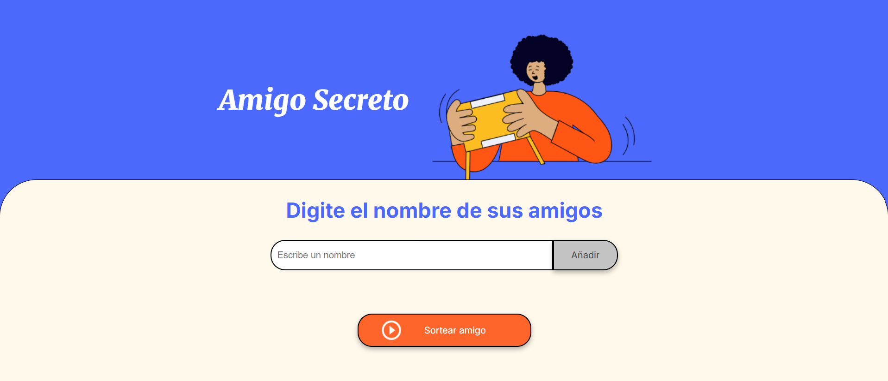

#  Amigo Secreto - Sorteo de Nombres



## 📖 Índice
1. [Descripción del Proyecto](#-descripción-del-proyecto)
2. [Estado del Proyecto](#-estado-del-proyecto)
3. [Demostración de Funciones y Aplicaciones](#-demostración-de-funciones-y-aplicaciones)
4. [Acceso al Proyecto](#-acceso-al-proyecto)
5. [Tecnologías Utilizadas](#-tecnologías-utilizadas)
6. [Licencia](#-licencia)

---

## 📋 Descripción del Proyecto
Este es un proyecto desarrollado en **JavaScript**, **HTML** y **CSS** que permite a los usuarios ingresar nombres de amigos en una lista y luego realizar un **sorteo aleatorio** para determinar quién será el "amigo secreto".

## 📌 Estado del Proyecto
Completado ✅

## 🎮 Demostración de Funciones y Aplicaciones

1. Escribe el nombre de un amigo en el campo de texto.
2. Presiona el botón **"Añadir"** para agregarlo a la lista.
3. Una vez que todos los nombres estén en la lista, haz clic en **"Sortear Amigo"**.
4. Se mostrará el nombre del amigo secreto en pantalla.

---

## 🌎 Acceso al Proyecto

1. **Clona este repositorio en tu computadora:**
   ```bash
   git clone https://github.com/MakaryV/ONE-challenge-1.git
   ```

2. **Accede a la carpeta del proyecto:**
   ```bash
   cd ONE-challenge-1
   ```

3. **Abre el archivo `index.html` en tu navegador.**


## 🔧 Tecnologías Utilizadas
- HTML5
- CSS3
- JavaScript

Elaborado por Lorena Avilés Arellano 
